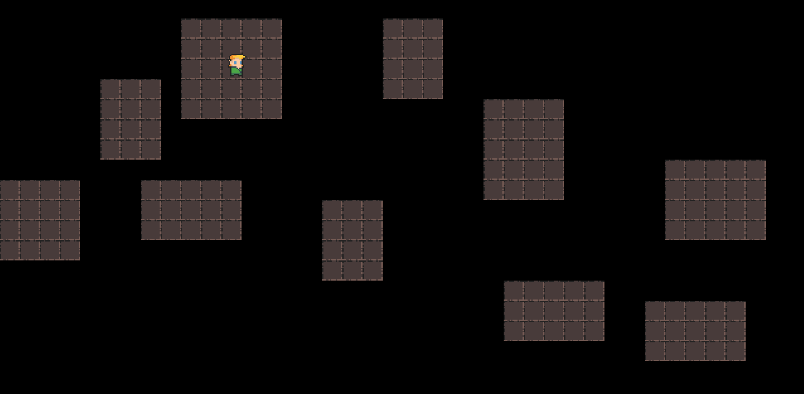
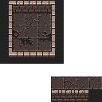
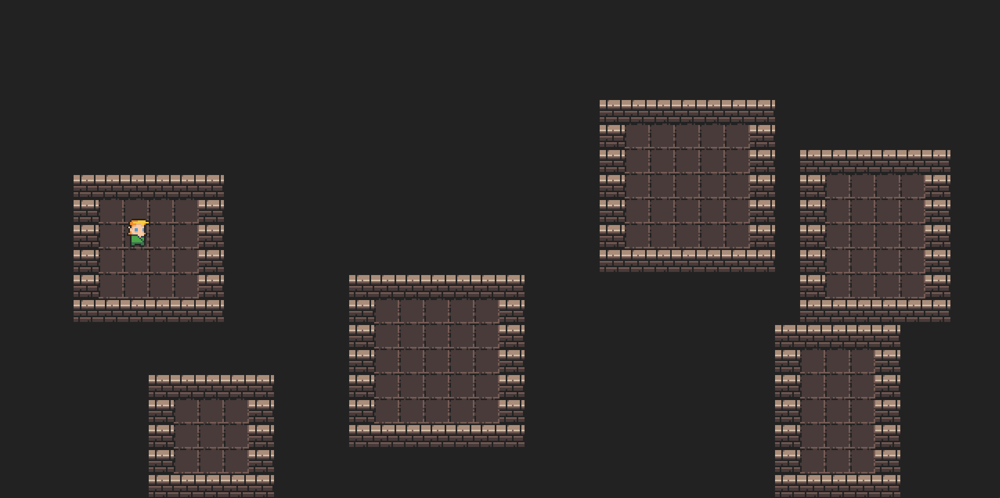
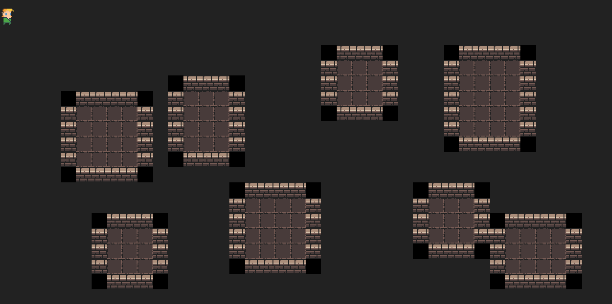
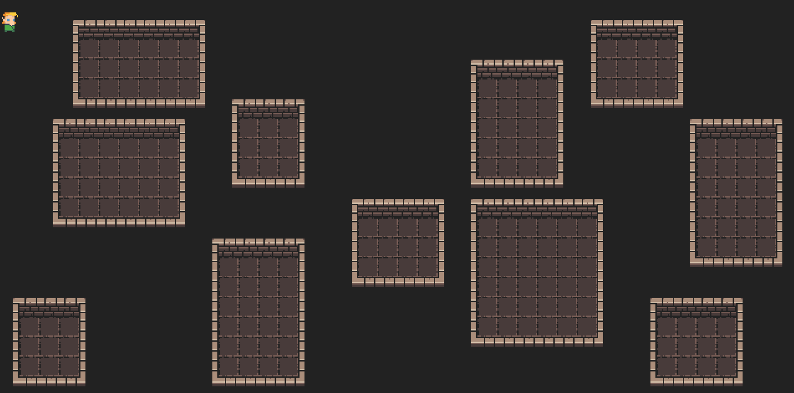
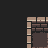
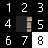
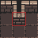

# Roguelike development with PyGame - Week 1

Let's dive into PyGame

<!-- more -->

## Day 1

### PyGame-ce :crown:

Turns out PyGame is not really extended anymore, so we should use PyGame-ce (Community Edition). 

It's not a big deal, because I barely started implementing something and ce is completely backwards compatible with pygame (with some additional features, larger community, etc)

### Moving Around, Animations :video_game:

This will be though, lol. I actually had to implement my own animation logic (by measuring time between updates, loading the next frames, etc). This is quite a unique experience after using Unity & Godot :laughing:

I just bought a book called [Game Programming Patterns](https://gameprogrammingpatterns.com/) where the author dives into quite some low-level topics. When I initially looked at them, I was like ... what the heck, most of these things are handled by the engine without me having to know about them ... Now it might be the time to actually start reading the book :book:.

<figure markdown="span">
    { width="600" }
</figure>

### Tiles

I created a simple baseclass for tiles, which seems to be working, but probably not that efficient, so I will have to read up on how to properly do this in PyGame.

<figure markdown="span">
    { width="600" }
</figure>

#### Goal   

I also created a dummy dungeon with [Tiled](https://www.mapeditor.org/), just to see how it would look like in the end.

My current issue is that the walls seem to be shifted in the X direction, so they don't line up to the tile borders (I don't know if this is intended or not), so I will probably have to fix that in order to make my life easier later.

<figure markdown="span">
    
</figure>

After filling it up with some props it is not such an eyesore anymore. Obviously getting here just from code will be an adventure, but thankfully Christmas season is around the corner, so we might have some free-time to work on it.

<figure markdown="span">
    
</figure>

### Map Generation 

I initialized the map procgen script (based on the PyRogue implementation), but I am way too tired to keep going, so I will call it a day.

Also, doing this with sprites will be a lot harder, since the walls are not a single character (like with tcodlib), 
but will actually have to connect, based on rules about their neighbors ... so it will be fun. 

<figure markdown="span">
    
</figure>

I also plan to extract the whole map generation & visualization part to a separate script where I can test other algorithms & can record some fancy videos about how they work. 

#### Adding walls around rooms

Okay, I couldn't stop working on this, so here are some updates. I created a tilemap where I only added the tiles that I need & aligned the walls correctly. This is how it looks right now (The bottom right corner is just some leftover from messing around)

<figure markdown="span">
    { width="300" }
</figure>

Then I continued implementing the procgen script to generate rooms & walls around them. First I don't differentiate between left/right/top/bottom walls, I only have 3 type of tiles: void (gray area), wall & floor.

<figure markdown="span">
    { width="600" }
</figure>

After that I started differentiating corners from walls, I added 4 additional type of sprites: TL_C (Top-Left Corner), TR_C (Top-Right Corner), BL_C (Bottom-Left Corner), BR_C (Bottom-Right Corner). I haven't implemented the part where I actually render the correct images, so it looks like this:

<figure markdown="span">
    { width="600" }
</figure>

And after differentiating between top/bottom/left/right walls too & correctly implementing the sprite rendering, it starts to look okay:

<figure markdown="span">
    { width="600" }
</figure>

My current "naive" solution will not work for too long, because in the next step we will have to add hallways too, where I can't define the wall types so easily, instead I will have to check the neighboring wall types and decide on the correct sprite based on that. But I leave that for tomorrow.

## Rest of the week

Okay, let's try to write a short overview of what happened during the rest of the week. I spent a lot of time on the map rendering code and I didn't have the energy to document everything as well.

### Tile neighbors

First things first, after spending some time on generating and visualizing the map I had a few issues:

I have to decide each tile's image based on the neighbors it has. Let's take a simple example. Below the blue tile is the one we are currently evaluating, the black tiles are wall tiles and the white one is a floor.

<figure markdown="span">
    { width="150" }
</figure>

This means that we have to place a corner tile to the center, like so:

<figure markdown="span">
    { width="150" }
</figure>

Because our environment will (likely) look something like this:

<figure markdown="span">
    { width="150" }
</figure>

Simple, right?

Not really. At least it is easier said than done, because if we label all neighbors, e.g. like this:

<figure markdown="span">
    { width="150" }
</figure>

Then we realize that we have 8 of them, each being able to be a wall or a floor. We don't care about the center tile, because we are focusing on wall only right now.

Having 8 neighbors with 2 states mean that we should check (and cover) 2^8 (256) possible combinations.

#### First attempt - The ugly

I looked around on the interwebz and found some ideas, like the [Dual-Grid System](https://www.youtube.com/watch?v=jEWFSv3ivTg) but I had the impression that it won't work for my wall usecase, but I will get back to it later, because it sounds promising. 

So, I started of by creating a binary string from the neighbors, like "111 00 000" which means that we have walls above us and floors around us, which should look like this in the end:

<figure markdown="span">
    { width="150" }
</figure>

After I had the neighbors I started manually mapping each binary string to an image from my tileset in a dictionary. If some tile was missing from the tileset I added it and continued on. I could keep this up for like ~50 entries, when the whole thing became so confusing that I couldn't continue. Obviously I was aware that this approach is terrible, but I wanted to test it. Well, it failed.

#### Second attempt - The uglier

After realizing that there were so many redundancies (e.g. you want to use the same tile image for multiple neighbor configurations), because in some cases it doesn't matter what kind of neighboring tile you have at position x. Just one example: for the picture above, if the bottom right corner would be a wall, you would still want to place the same tile in the middle, because they wouldn't connect.

This realization gave me the perfect solution: Instead of using one binary string mapping, I could use a "rule mapping" and an "interest mapping".
Both of them would be 8 long binary string, the "interest mapping" would define on which positions I want the binary values to match to the "rule mapping".

For example:

* "Interest mapping": 000 11 000 (I only care about what's on my left and right side)
* "Rule mapping": 000 10 000 (On my left side there must be a wall and on my right side there must be a floor)
* These rules would match a lot of values, e.g.: 111 10 000, 000 10 111, etc.

Great idea! Now I have to define a lot less rules, because by defining 1 interest mapping and 1 rule mapping I can cover a lot of usecases.

The reality was that this got even more confusing, because after like 10-20 entries I had no clue when something was wrong if I messed up a rule or a tile set image was missing or what the issue was.