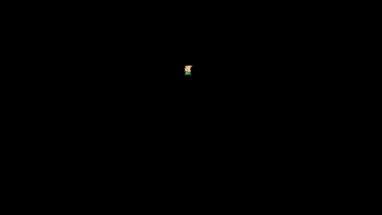
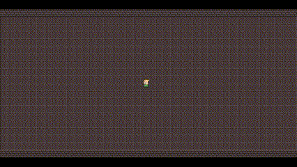
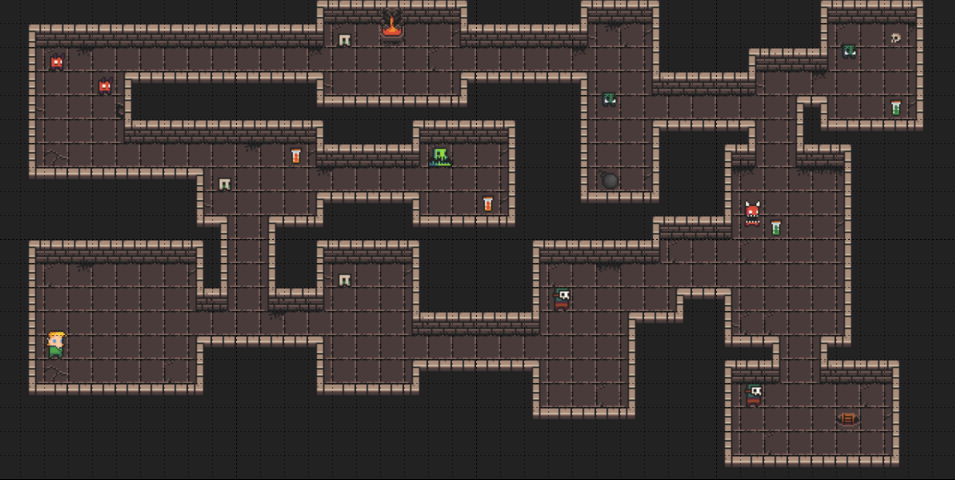

# Roguelike development with PyGame - Week 1

Let's dive into PyGame

<!-- more -->

## Day 1

### PyGame-ce :crown:

Turns out PyGame is not really extended anymore, so we should use PyGame-ce (Community Edition). 

It's not a big deal, because I barely started implementing something and ce is completely backwards compatible with pygame (with some additional features, larger community, etc)

### Moving Around, Animations :video_game:

This will be though, lol. I actually had to implement my own animation logic (by measuring time between updates, loading the next frames, etc). This is quite a unique experience after using Unity & Godot :laughing:

I just bought a book called [Game Programming Patterns](https://gameprogrammingpatterns.com/) where the author dives into quite some low-level topics. When I initially looked at them, I was like ... what the heck, most of these things are handled by the engine without me having to know about them ... Now it might be the time to actually start reading the book :book:.

<figure markdown="span">
    { width="600" }
</figure>

### Tiles

I created a simple baseclass for tiles, which seems to be working, but probably not that efficient, so I will have to read up on how to properly do this in PyGame.

<figure markdown="span">
    { width="600" }
</figure>

#### Goal   

I also created a dummy dungeon with [Tiled](https://www.mapeditor.org/), just to see how it would look like in the end.

My current issue is that the walls seem to be shifted in the X direction, so they don't line up to the tile borders (I don't know if this is intended or not), so I will probably have to fix that in order to make my life easier later.

<figure markdown="span">
    
</figure>

After filling it up with some props it is not such an eyesore anymore. Obviously getting here just from code will be an adventure, but thankfully Christmas season is around the corner, so we might have some free-time to work on it.

<figure markdown="span">
    
</figure>
