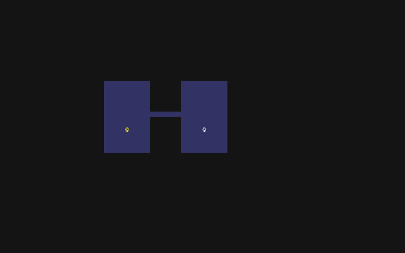

# PyRouge #1

Yes, I misspelled the name, but it is too late to change the repository name and everything, so it will remain Py*Rouge*.

Content:

* Some rambling intro
* Generating maps

<!-- more -->

## Build your own X :wrench:

I found an amazing repository called [Build your own X](https://github.com/codecrafters-io/build-your-own-x), which is a collection of posts, videos, tutorials, guides about implementing your own X ("X" being a game, a cli, a database or something like that).

This would help you understand how that "X" works and you would learn a lot about the programming language that is being used for the implementation. This finally gave me a burst of motivation to start coding something.

## RoguelikeTutorials :video_game:

Obviously I jumped straight to the "Game" section, where I found a great site: [RoguelikeTutorials.com](https://rogueliketutorials.com) and started coding along right away.

The tutorial uses Python and [tcod](https://github.com/libtcod/python-tcod) (a C library ported to Python that contains useful things for roguelike game development, like a customizable console, grid-based pathfinding, etc) to implement the basics of the original Rogue.

## Why :confused:

Long story short, in my lifetime I want to implement a game.
Probably not now and not even next year ... but sometime when I will have enough dedication and experience.
A game that I enjoy playing.
And I only play (and enjoy) online / multiplayer games, but implementing those are *god-damn hard*.

Creating a good single-player game is hard enough for a solo (or small team) indie developer(s) ... you have to think about UI / UX, a good gameplay loop, a hook, a progression system, balance, a story, a coherent visual design, ... and the list goes on.
Adding server-authoritative networking to the picture makes the whole thing 10x harder.

Okay, let's continue with the Rogue stuff!

## Part 1-2

I forgot to take screenshots, but the first two parts are just basic project setup and creating the skeletons of the architecture.

## Part 3 - Generating maps

Implementation of the map generation started, now we can create rooms (currently by hand, but this will change shortly).

And the first (very simple) dungeon room generating function is implemented!

To be honest I don't really like the generated layouts (too many paths, paths are overlapping, paths running along the side of the rooms), so I will try to come up with a different one after I finished the complete tutorial.

---
I continue this journey in [Part Two!](rogue_part_2.md)