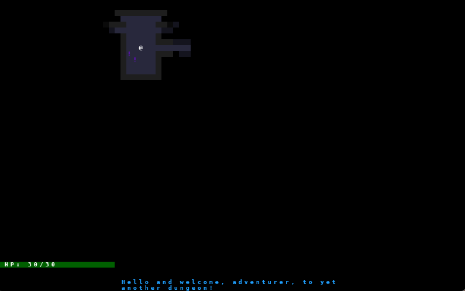

# PyRouge #3

Last part of my journey of implementing  Py*Rouge*.

Content:

* Items and Inventory
* Ranged Scrolls and Targeting
* Saving and loading
* Delving into the Dungeon
* Increasing Difficulty
* Gearing up

<!-- more -->

## Part 8 - Items and Inventory

Another great chapter! We created some classes to support items & a basic inventory system. We implemented our first item: Health Potions, then we updated our procgen script to also generate these items in the rooms. Now we are able to pick up these potions and drink them to get some health back after fighting!

I also changed the colors a bit to make things more visible.

I really recommend this [tutorial](https://rogueliketutorials.com/) for everyone, because it is awesome and I feel like I learn a lot just by following (and basically copy-pasting code from the browser to the IDE) through.

<figure class="video_container">
    <video controls src="../../../../images/part_8_inventory.mp4" title="Title"></video>
</figure>

# Part 9 - Ranged Scrolls and Targeting

Just finished adding ranged scrolls:

* Confusion scroll (enemy AI changes to just wandering around for a few turns)
* Lighting scroll (deals huge damage to the closest enemy)
* Fireball scroll (deals AOE damage)

I also started uploading videos to Youtube instead, because embedding all of them here would increase the repo size significantly.

<iframe width="800" height="400" src="https://www.youtube.com/embed/zPSMPrQLOfc?si=KodIynhd0viCL5Mq" title="PyRouge - Part 9" frameborder="0" allow="accelerometer; autoplay; clipboard-write; encrypted-media; gyroscope; picture-in-picture; web-share" referrerpolicy="strict-origin-when-cross-origin" allowfullscreen></iframe>

TODOS:

* Lighting scroll range is not visible
* Fireball range seems to be infinite and can be casted anywhere

These will probably have to change later.

# Part 10 - Saving and loading

Tomorrow